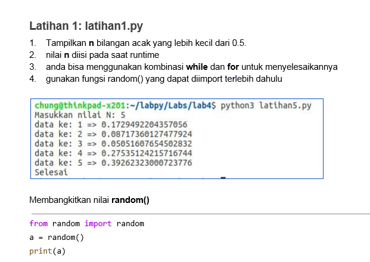
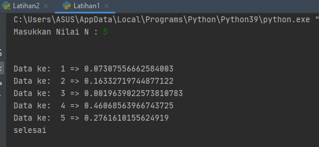

 # labpy03
Repository ini dibuat untuk memenuhi tugas bahasa pemrograman pertemuan 7 modul praktikum 3

***Nama     : Antini permatasari***

***NIM      : 312010095***

***Kelas    : T1.20.B.1***

* pada repository ini saya mendapatkan tugas dari Dosen Bahasa pemogrmaan untuk program yang ada pada latihan 1 , latihan 2 dan program 1.
 untuk tugas -tugas tersebut bisa dilihat pada link berikut : <br>
1. [link_latihan1](latihan1.py)
2. [link_latihan2](latihan2.py)
3. [link_program1](program1.py)
<br>

pertama saya akan membahas tentang tugas latihan 1 yaitu menampilkan (n) bilangan acak yang lebiih kecil dari 0.5. di program ini saya menggunakan source code seperti ini : <br>

```python
n=int(input("Masukkan Nilai N : "))

import random

for y in list(range(1, n+1, 1)):
    print("Data ke: ",y,"=>",random.uniform(0, 0.5))

print("selesai")
```
Pada source code tersebut saya menggunakan kombinasi random dan uniform, sehingga menghasilkan output seperti dibawah ini : <br>


* ket : <br>
fungsi random() akan menghasilkan angka yang memiliki tipe data float dan berada pada rentang 0,0 hingga 1,0. Pada fungsi ini tidak perlu menambahkan argument. <br>
uniform sendiri berfungsi untuk menampilkan bilangan float random dengan batas awal bilangan dan batas akhir.


