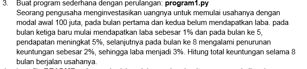

 # labpy03
Repository ini dibuat untuk memenuhi tugas bahasa pemrograman pertemuan 7 modul praktikum 3

***Nama     : Antini permatasari***

***NIM      : 312010095***

***Kelas    : T1.20.B.1***

* pada repository ini saya mendapatkan tugas dari Dosen Bahasa pemogrmaan untuk program yang ada pada latihan 1 , latihan 2 dan program 1.
 untuk tugas -tugas tersebut bisa dilihat pada link berikut : <br>
1. [link_latihan1](latihan1.py)
2. [link_latihan2](latihan2.py)
3. [link_program1](program1.py)
<br>

pertama saya akan membahas tentang tugas latihan 1 yaitu menampilkan (n) bilangan acak yang lebiih kecil dari 0.5. di program ini saya menggunakan source code seperti ini : <br>

```python
n=int(input("Masukkan Nilai N : "))

import random

for y in list(range(1, n+1, 1)):
    print("Data ke: ",y,"=>",random.uniform(0, 0.5))

print("selesai")
```
Pada source code tersebut saya menggunakan kombinasi random dan uniform, sehingga menghasilkan output seperti dibawah ini : <br>


* ket : <br>
fungsi random() akan menghasilkan angka yang memiliki tipe data float dan berada pada rentang 0,0 hingga 1,0. Pada fungsi ini tidak perlu menambahkan argument. <br>
uniform sendiri berfungsi untuk menampilkan bilangan float random dengan batas awal bilangan dan batas akhir.


* **Latihan 2**

Pada latihan ke-2 ini Dosen memberikan tugas untuk menampilkan bilangan terbesar dari (n). <br>


pada tugas ini saya menggunakan source code :
```python
print("Tugas pertemuan 7 - pratikum 3 - Latihan 2")

yangka=0
while True:
        xbilangan = int(input("Masukkkan Bilangan : "))
        if (yangka < xbilangan):
            yangka=xbilangan
        if (xbilangan == 0):
            break

print("Bilangan terbesar adalah : " ,yangka)
print()
```
pada source code tersebut ini akan menghasilkan output seperti :


* Note : <br>
-perulangan **(while)** disebut uncounted loop (perulangan yang tak terhitung), yaitu perulangan yang dilakukan berdasarkan kondisi tersebut selama nilai kondisi bernilai **True**
- kondisi **if** digunakan untuk mengeksekusikan kode jika kondisi bernilai benar (True)
-pernyataan **Break** digunakan untuk menghentikan process perulangan pada kondisi tertentu.

<br>

* **program 1**

pada program ini akan menghitung laba seorang pengusaha salam waktu 8 bulan terhitung dari bulan pertama. 


Dalam program ini saya menggunakan source code seperti dibawah ini.
```python
print("Tugas pertemuan 7 - pratikum 3 - program 1 \n")

modalawal = 100000000

for bulan in range(1, 9, 1):
    # Menentukan laba pada bulan ke 1 dan ke 2
    if (bulan >= 1) and (bulan <= 2):
        # laba bulan 1 dan 2 adalah 0%
        laba12 = modalawal * 0
        print(f"Laba bulan ke {bulan} : {laba12}")

    if (bulan >= 3) and (bulan <= 4):
        # laba bulan 3 dan 4 adalah 1%
        laba34 = modalawal * 0.01
        print(f"Laba bulan ke {bulan} : {laba34}")

    if (bulan >= 5) and (bulan <= 7):
        # Laba bulan 5, 6, 7 adalah 5%
        laba567 = modalawal * 0.05
        print(f"Laba bulan ke {bulan} : {laba567}")

    if bulan == 8:
        laba8 = modalawal * 0.03
        print(f"Laba bulan ke {bulan} : {laba8}")

totallaba = laba12+laba12+laba34+laba34+laba567+laba567+laba567+laba8

print(f"\nTotal laba adalah : {totallaba}")
print
```

Dari source code tersebut kita akan mendapatkan output : <br>


* Note : <br>
-Kondisi **if** digunakan untuk mengeksekusikan kode jika kondisi bernilai benar (True)
pada setiap bulannya pengusaha mengalami penurunan dan kenaikan keuntungan / laba,

<br>

========= ***Antini permatasari*** =========

=============== ***312010095***=============

=============== ***Thank you*** ============